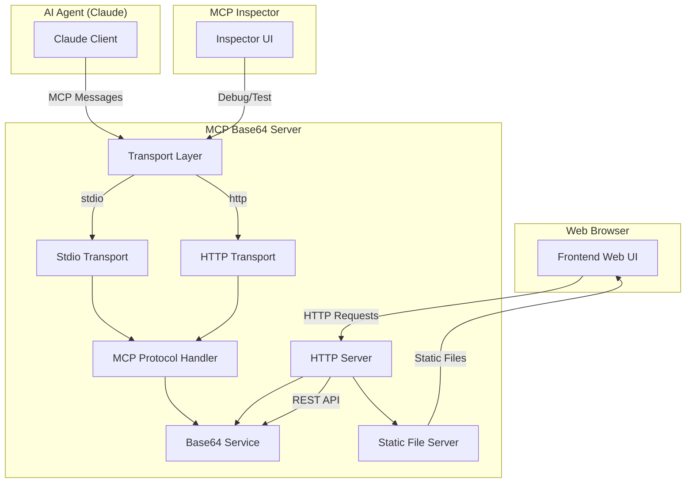

# 设计文档

## 概述

本项目设计一个基于Python的MCP (Model Context Protocol) 服务器，提供base64编码和解码功能。系统采用模块化架构，支持stdio和HTTP两种传输方式，为AI代理提供标准化的工具接口。

### 核心设计原则

- **模块化设计**: 分离传输层、协议层和业务逻辑层
- **教育友好**: 代码结构清晰，注释详尽，便于学习MCP协议
- **双传输支持**: 同时支持stdio和HTTP传输，满足不同部署场景
- **错误处理**: 完善的错误处理机制，提供清晰的错误信息
- **调试支持**: 支持与MCP Inspector工具集成，便于开发和调试

## 架构

### 系统架构图



### 分层架构

1. **传输层 (Transport Layer)**
   - Stdio Transport: 标准输入输出通信
   - HTTP Transport: HTTP协议通信
   - 抽象接口确保传输方式的可互换性

2. **协议层 (Protocol Layer)**
   - MCP消息解析和序列化
   - 工具注册和管理
   - 请求路由和响应处理

3. **业务逻辑层 (Business Logic Layer)**
   - Base64编码/解码实现
   - 参数验证和错误处理
   - 日志记录和监控

4. **HTTP服务层 (HTTP Service Layer)**
   - 独立的HTTP API服务
   - RESTful接口设计
   - 与MCP服务并行运行

5. **前端展示层 (Frontend Presentation Layer)**
   - 静态文件服务
   - 响应式Web界面
   - 实时交互功能

## 组件和接口

### 1. MCP协议处理器 (MCPProtocolHandler)

```python
class MCPProtocolHandler:
    """
    MCP协议的核心处理器，负责消息解析、工具管理和请求分发
    """
    
    def __init__(self, transport: Transport):
        """初始化协议处理器"""
        
    def register_tools(self) -> None:
        """注册可用工具"""
        
    def handle_request(self, request: MCPRequest) -> MCPResponse:
        """处理MCP请求"""
        
    def list_tools(self) -> List[ToolDefinition]:
        """返回可用工具列表"""
        
    def call_tool(self, name: str, arguments: Dict) -> ToolResult:
        """调用指定工具"""
```

### 2. 传输层接口 (Transport)

```python
class Transport(ABC):
    """传输层抽象基类"""
    
    @abstractmethod
    def send_message(self, message: MCPMessage) -> None:
        """发送MCP消息"""
        
    @abstractmethod
    def receive_message(self) -> MCPMessage:
        """接收MCP消息"""
        
    @abstractmethod
    def start(self) -> None:
        """启动传输层"""
        
    @abstractmethod
    def stop(self) -> None:
        """停止传输层"""
```

### 3. Base64服务 (Base64Service)

```python
class Base64Service:
    """
    Base64编码解码服务，提供核心业务逻辑
    """
    
    def encode(self, text: str) -> str:
        """将文本编码为base64字符串"""
        
    def decode(self, base64_str: str) -> str:
        """将base64字符串解码为文本"""
        
    def validate_base64(self, base64_str: str) -> bool:
        """验证base64字符串格式"""
```

### 4. HTTP服务器 (HTTPServer)

```python
class HTTPServer:
    """
    独立的HTTP服务器，提供REST API接口和静态文件服务
    """
    
    def __init__(self, port: int = 8080):
        """初始化HTTP服务器"""
        
    def start(self) -> None:
        """启动HTTP服务器"""
        
    def handle_encode(self, request) -> Response:
        """处理编码请求"""
        
    def handle_decode(self, request) -> Response:
        """处理解码请求"""
        
    def serve_static(self, path: str) -> Response:
        """提供静态文件服务"""
        
    def handle_cors(self, request) -> Response:
        """处理CORS预检请求"""
```

### 5. 前端Web界面 (Frontend Web UI)

前端采用现代Web技术栈，提供直观的用户界面：

#### 技术选择
- **HTML5**: 语义化标记和现代Web标准
- **CSS3**: 响应式设计和现代样式
- **Vanilla JavaScript**: 轻量级，无框架依赖
- **Bootstrap/Tailwind CSS**: 快速UI开发（可选）

#### 界面设计
```html
<!-- 主界面结构 -->
<div class="container">
    <header>
        <h1>Base64 编码解码工具</h1>
        <p>支持文本和文件的Base64编码解码</p>
    </header>
    
    <main>
        <div class="encode-section">
            <h2>编码 (Text → Base64)</h2>
            <textarea id="text-input" placeholder="输入要编码的文本..."></textarea>
            <button id="encode-btn">编码</button>
            <textarea id="encoded-output" readonly></textarea>
            <button id="copy-encoded">复制结果</button>
        </div>
        
        <div class="decode-section">
            <h2>解码 (Base64 → Text)</h2>
            <textarea id="base64-input" placeholder="输入要解码的Base64字符串..."></textarea>
            <button id="decode-btn">解码</button>
            <textarea id="decoded-output" readonly></textarea>
            <button id="copy-decoded">复制结果</button>
        </div>
        
        <div class="file-section">
            <h2>文件处理</h2>
            <input type="file" id="file-input">
            <button id="encode-file">编码文件</button>
            <button id="download-result">下载结果</button>
        </div>
    </main>
</div>
```

#### JavaScript功能模块
```javascript
class Base64WebClient {
    constructor(apiBaseUrl = '') {
        this.apiBaseUrl = apiBaseUrl;
        this.initEventListeners();
    }
    
    async encodeText(text) {
        // 调用后端编码API
    }
    
    async decodeBase64(base64String) {
        // 调用后端解码API
    }
    
    handleFileUpload(file) {
        // 处理文件上传和编码
    }
    
    copyToClipboard(text) {
        // 复制到剪贴板功能
    }
    
    showError(message) {
        // 显示错误提示
    }
    
    showSuccess(message) {
        // 显示成功提示
    }
}
```

## 数据模型

### MCP消息结构

```python
@dataclass
class MCPRequest:
    """MCP请求消息"""
    jsonrpc: str = "2.0"
    id: Union[str, int, None] = None
    method: str = ""
    params: Dict[str, Any] = field(default_factory=dict)

@dataclass
class MCPResponse:
    """MCP响应消息"""
    jsonrpc: str = "2.0"
    id: Union[str, int, None] = None
    result: Optional[Dict[str, Any]] = None
    error: Optional[MCPError] = None

@dataclass
class MCPError:
    """MCP错误信息"""
    code: int
    message: str
    data: Optional[Dict[str, Any]] = None
```

### 工具定义

```python
@dataclass
class ToolDefinition:
    """工具定义结构"""
    name: str
    description: str
    inputSchema: Dict[str, Any]

# Base64编码工具定义
BASE64_ENCODE_TOOL = ToolDefinition(
    name="base64_encode",
    description="将文本字符串编码为base64格式",
    inputSchema={
        "type": "object",
        "properties": {
            "text": {
                "type": "string",
                "description": "要编码的文本字符串"
            }
        },
        "required": ["text"]
    }
)

# Base64解码工具定义
BASE64_DECODE_TOOL = ToolDefinition(
    name="base64_decode", 
    description="将base64字符串解码为文本",
    inputSchema={
        "type": "object",
        "properties": {
            "base64_string": {
                "type": "string",
                "description": "要解码的base64字符串"
            }
        },
        "required": ["base64_string"]
    }
)
```

### HTTP API数据模型

```python
@dataclass
class EncodeRequest:
    """编码请求"""
    text: str

@dataclass
class DecodeRequest:
    """解码请求"""
    base64_string: str

@dataclass
class APIResponse:
    """API响应"""
    success: bool
    result: Optional[str] = None
    error: Optional[str] = None
```

## 错误处理

### 错误分类

1. **协议错误**
   - 无效的JSON-RPC格式
   - 不支持的方法调用
   - 参数验证失败

2. **业务逻辑错误**
   - 无效的base64字符串
   - 编码/解码失败
   - 参数类型错误

3. **传输错误**
   - 连接中断
   - 超时错误
   - 网络异常

### 错误处理策略

```python
class ErrorHandler:
    """统一错误处理器"""
    
    ERROR_CODES = {
        'INVALID_REQUEST': -32600,
        'METHOD_NOT_FOUND': -32601,
        'INVALID_PARAMS': -32602,
        'INTERNAL_ERROR': -32603,
        'PARSE_ERROR': -32700,
        'INVALID_BASE64': -1001,
        'ENCODING_ERROR': -1002,
        'DECODING_ERROR': -1003
    }
    
    @staticmethod
    def create_error(code: str, message: str, data: Dict = None) -> MCPError:
        """创建标准化错误对象"""
        
    @staticmethod
    def handle_exception(e: Exception) -> MCPError:
        """处理异常并转换为MCP错误"""
```

## 测试策略

### 单元测试

1. **Base64Service测试**
   - 正常编码/解码功能
   - 边界条件测试
   - 错误输入处理

2. **MCP协议测试**
   - 消息序列化/反序列化
   - 工具注册和调用
   - 错误响应处理

3. **传输层测试**
   - Stdio通信测试
   - HTTP传输测试
   - 连接异常处理

### 集成测试

1. **端到端测试**
   - 完整的MCP工具调用流程
   - 多种传输方式验证
   - 错误场景测试

2. **MCP Inspector集成测试**
   - 工具发现和调用
   - 调试信息展示
   - 错误诊断功能

### 性能测试

1. **并发处理能力**
   - 多客户端同时连接
   - 高频率请求处理
   - 内存使用监控

2. **响应时间测试**
   - 编码/解码操作延迟
   - 网络传输延迟
   - 系统资源占用

## 部署和配置

### 配置文件结构

```yaml
# config.yaml
server:
  name: "mcp-base64-server"
  version: "1.0.0"
  
transport:
  type: "stdio"  # 或 "http"
  http:
    host: "localhost"
    port: 3000
    
http_server:
  enabled: true
  port: 8080
  host: "0.0.0.0"
  
logging:
  level: "INFO"
  format: "%(asctime)s - %(name)s - %(levelname)s - %(message)s"
  
debug:
  enabled: false
  inspector_port: 9000
```

### 启动脚本

```python
# main.py
def main():
    """主启动函数"""
    config = load_config()
    
    # 初始化服务
    base64_service = Base64Service()
    
    # 选择传输方式
    if config.transport.type == "stdio":
        transport = StdioTransport()
    else:
        transport = HTTPTransport(
            host=config.transport.http.host,
            port=config.transport.http.port
        )
    
    # 启动MCP服务器
    mcp_server = MCPServer(transport, base64_service)
    
    # 启动HTTP服务器（如果启用）
    if config.http_server.enabled:
        http_server = HTTPServer(
            port=config.http_server.port,
            service=base64_service
        )
        http_server.start()
    
    # 启动MCP服务器
    mcp_server.start()
```

### Docker部署

```dockerfile
FROM python:3.11-slim

WORKDIR /app

COPY requirements.txt .
RUN pip install -r requirements.txt

COPY . .

EXPOSE 8080 3000

CMD ["python", "main.py"]
```

## 安全考虑

### 输入验证

1. **参数验证**
   - 严格的JSON Schema验证
   - 输入长度限制
   - 字符编码验证

2. **Base64验证**
   - 格式正确性检查
   - 解码安全性验证
   - 恶意输入防护

### 访问控制

1. **传输安全**
   - HTTPS支持（HTTP传输模式）
   - 认证机制（可选）
   - 速率限制

2. **资源保护**
   - 内存使用限制
   - 请求大小限制
   - 超时控制

## 监控和日志

### 日志记录

```python
import logging

# 配置日志记录器
logger = logging.getLogger('mcp-base64-server')

# 关键事件日志
- 服务器启动/停止
- 工具调用记录
- 错误和异常
- 性能指标

# 调试日志
- MCP消息详情
- 传输层通信
- 内部状态变化
```

### 监控指标

1. **性能指标**
   - 请求处理时间
   - 并发连接数
   - 内存使用情况
   - CPU使用率

2. **业务指标**
   - 编码/解码成功率
   - 错误类型分布
   - 工具调用频率

这个设计文档提供了实现MCP Base64服务器的完整技术方案，涵盖了架构设计、接口定义、错误处理、测试策略和部署方案。设计充分考虑了教育目的，确保代码结构清晰、注释详尽，便于开发者学习MCP协议和AI代理集成原理。