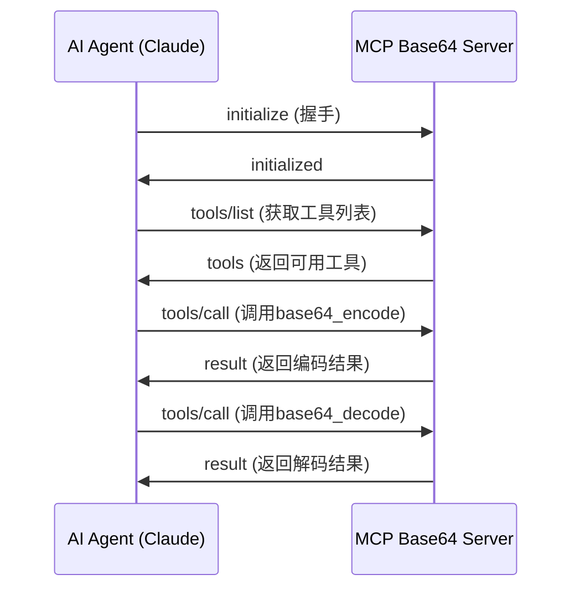

# MCP Base64 Server

一个基于Python的MCP (Model Context Protocol) 服务器，为AI代理提供base64编码和解码功能。该项目支持stdio和HTTP两种传输方式，包含完整的Web界面，并提供详尽的文档用于学习MCP协议和AI代理集成。

## 🌟 特性

- **🔧 MCP工具支持**: 提供`base64_encode`和`base64_decode`工具供AI代理使用
- **🚀 双传输模式**: 支持stdio和HTTP两种MCP传输方式
- **🌐 Web界面**: 优美的响应式Web界面，支持实时编解码
- **📊 性能监控**: 内置性能监控和日志记录
- **🔍 调试支持**: 完全兼容MCP Inspector工具
- **📚 教育友好**: 详尽的代码注释和文档，便于学习MCP协议
- **⚙️ 灵活配置**: 支持YAML配置文件和命令行参数

## 📋 目录

- [快速开始](#快速开始)
- [MCP协议基础](#mcp协议基础)
- [安装指南](#安装指南)
- [配置说明](#配置说明)
- [使用方法](#使用方法)
- [API文档](#api文档)
- [MCP工具说明](#mcp工具说明)
- [Web界面使用](#web界面使用)
- [开发指南](#开发指南)
- [故障排除](#故障排除)
- [贡献指南](#贡献指南)

## 🚀 快速开始

### 1. 安装依赖

```bash
# 克隆项目
git clone <repository-url>
cd mcp-base64-server

# 安装Python依赖
pip install -r requirements.txt
```

### 2. 启动服务器

#### Stdio模式（推荐用于AI代理集成）

```bash
python main.py --transport stdio
```

#### HTTP模式（推荐用于调试和测试）

```bash
python main.py --transport http --http-port 3000
```

#### 启用Web界面

```bash
python main.py --enable-http-server --http-server-port 8080
```

### 3. 测试连接

使用MCP Inspector或直接通过HTTP API测试：

```bash
# 测试编码
curl -X POST http://localhost:8080/encode \
  -H "Content-Type: application/json" \
  -d '{"text": "Hello, World!"}'

# 测试解码
curl -X POST http://localhost:8080/decode \
  -H "Content-Type: application/json" \
  -d '{"base64_string": "SGVsbG8sIFdvcmxkIQ=="}'
```

## 📖 MCP协议基础

### 什么是MCP？

Model Context Protocol (MCP) 是一个开放标准，用于AI代理与外部工具和数据源的安全连接。它允许AI模型访问实时信息、执行操作并与各种系统集成。

### MCP的核心概念

1. **工具 (Tools)**: AI代理可以调用的功能，如我们的base64编码/解码工具
2. **传输 (Transport)**: 消息传递机制，支持stdio和HTTP
3. **协议 (Protocol)**: 基于JSON-RPC 2.0的消息格式
4. **服务器 (Server)**: 提供工具的服务端，如本项目
5. **客户端 (Client)**: 使用工具的AI代理，如Claude

### MCP消息流程



### 为什么选择MCP？

- **标准化**: 统一的协议规范，确保兼容性
- **安全性**: 明确的权限控制和数据边界
- **可扩展性**: 易于添加新工具和功能
- **互操作性**: 支持多种传输方式和编程语言

## 🔧 安装指南

### 系统要求

- Python 3.8+
- 操作系统: Windows, macOS, Linux
- 内存: 最少256MB RAM
- 磁盘空间: 50MB

### 开发环境安装

```bash
# 1. 创建虚拟环境（推荐）
python -m venv venv

# 2. 激活虚拟环境
# Windows
venv\Scripts\activate
# macOS/Linux
source venv/bin/activate

# 3. 升级pip
pip install --upgrade pip

# 4. 安装依赖
pip install -r requirements.txt

# 5. 验证安装
python main.py --help
```

### 生产环境安装

#### 使用Docker

```bash
# 构建镜像
docker build -t mcp-base64-server .

# 运行容器（stdio模式）
docker run -i mcp-base64-server

# 运行容器（HTTP模式）
docker run -p 3000:3000 -p 8080:8080 mcp-base64-server \
  --transport http --enable-http-server
```

#### 使用systemd（Linux）

创建服务文件 `/etc/systemd/system/mcp-base64-server.service`:

```ini
[Unit]
Description=MCP Base64 Server
After=network.target

[Service]
Type=simple
User=mcp
WorkingDirectory=/opt/mcp-base64-server
ExecStart=/opt/mcp-base64-server/venv/bin/python main.py --transport http
Restart=always
RestartSec=10

[Install]
WantedBy=multi-user.target
```

启动服务：

```bash
sudo systemctl enable mcp-base64-server
sudo systemctl start mcp-base64-server
```

## ⚙️ 配置说明

### 配置文件结构

项目使用YAML格式的配置文件 `config.yaml`:

```yaml
# 服务器基本信息
server:
  name: "mcp-base64-server"
  version: "1.0.0"
  description: "MCP server providing base64 encoding and decoding tools"

# MCP传输配置
transport:
  type: "stdio"  # 或 "http"
  http:
    host: "localhost"
    port: 3000

# HTTP API服务器配置
http_server:
  enabled: false
  host: "0.0.0.0"
  port: 8080

# 日志配置
logging:
  level: "INFO"
  format: "%(asctime)s - %(name)s - %(levelname)s - %(message)s"

# 调试配置
debug:
  enabled: false
  inspector_port: 9000
```

### 配置选项详解

#### 服务器配置 (server)

- `name`: 服务器名称，用于标识
- `version`: 版本号
- `description`: 服务器描述

#### 传输配置 (transport)

- `type`: 传输类型
  - `"stdio"`: 标准输入输出，适用于AI代理集成
  - `"http"`: HTTP协议，适用于调试和测试
- `http.host`: HTTP传输监听地址
- `http.port`: HTTP传输监听端口

#### HTTP服务器配置 (http_server)

- `enabled`: 是否启用独立的HTTP API服务器
- `host`: HTTP服务器监听地址
- `port`: HTTP服务器监听端口

#### 日志配置 (logging)

- `level`: 日志级别 (DEBUG, INFO, WARNING, ERROR)
- `format`: 日志格式字符串

### 命令行参数

所有配置都可以通过命令行参数覆盖：

```bash
python main.py \
  --transport http \
  --http-host 0.0.0.0 \
  --http-port 3000 \
  --enable-http-server \
  --http-server-port 8080 \
  --log-level DEBUG \
  --config custom-config.yaml
```

### 环境变量支持

支持通过环境变量设置配置：

```bash
export MCP_TRANSPORT_TYPE=http
export MCP_HTTP_PORT=3000
export MCP_LOG_LEVEL=DEBUG
python main.py
```

## 📘 使用方法

### 1. 与AI代理集成

#### 配置Claude Desktop

在Claude Desktop的配置文件中添加：

```json
{
  "mcpServers": {
    "base64-server": {
      "command": "python",
      "args": ["/path/to/mcp-base64-server/main.py", "--transport", "stdio"],
      "env": {}
    }
  }
}
```

#### 配置其他MCP客户端

```python
import asyncio
from mcp_client import MCPClient

async def main():
    # 连接到MCP服务器
    client = MCPClient()
    await client.connect_stdio([
        "python", "/path/to/mcp-base64-server/main.py", 
        "--transport", "stdio"
    ])
    
    # 获取可用工具
    tools = await client.list_tools()
    print("Available tools:", [tool.name for tool in tools])
    
    # 调用base64编码工具
    result = await client.call_tool("base64_encode", {"text": "Hello, World!"})
    print("Encoded:", result.content)
    
    # 调用base64解码工具
    result = await client.call_tool("base64_decode", {"base64_string": "SGVsbG8sIFdvcmxkIQ=="})
    print("Decoded:", result.content)

asyncio.run(main())
```

### 2. 使用MCP Inspector调试

MCP Inspector是官方提供的调试工具：

```bash
# 安装MCP Inspector
npm install -g @modelcontextprotocol/inspector

# 启动服务器（HTTP模式）
python main.py --transport http --http-port 3000

# 在另一个终端启动Inspector
mcp-inspector http://localhost:3000/mcp
```

Inspector界面功能：
- 查看可用工具列表
- 测试工具调用
- 查看请求/响应详情
- 调试连接问题

### 3. 直接HTTP API调用

#### 编码文本

```bash
curl -X POST http://localhost:8080/encode \
  -H "Content-Type: application/json" \
  -d '{
    "text": "Hello, World!"
  }'
```

响应：
```json
{
  "success": true,
  "result": "SGVsbG8sIFdvcmxkIQ=="
}
```

#### 解码Base64

```bash
curl -X POST http://localhost:8080/decode \
  -H "Content-Type: application/json" \
  -d '{
    "base64_string": "SGVsbG8sIFdvcmxkIQ=="
  }'
```

响应：
```json
{
  "success": true,
  "result": "Hello, World!"
}
```

### 4. 不同部署场景

#### 场景1: 本地开发和测试

```bash
# 启动完整功能的服务器
python main.py \
  --transport http \
  --enable-http-server \
  --log-level DEBUG
```

#### 场景2: AI代理集成

```bash
# 仅启动MCP服务器（stdio模式）
python main.py --transport stdio
```

#### 场景3: 生产环境

```bash
# 使用配置文件启动
python main.py --config production-config.yaml
```

## 📚 API文档

### MCP工具API

#### base64_encode

将文本字符串编码为base64格式。

**参数:**
- `text` (string, required): 要编码的文本字符串

**返回:**
- `result` (string): base64编码后的字符串

**示例:**
```json
{
  "method": "tools/call",
  "params": {
    "name": "base64_encode",
    "arguments": {
      "text": "Hello, World!"
    }
  }
}
```

**响应:**
```json
{
  "result": {
    "content": [
      {
        "type": "text",
        "text": "SGVsbG8sIFdvcmxkIQ=="
      }
    ]
  }
}
```

#### base64_decode

将base64字符串解码为文本。

**参数:**
- `base64_string` (string, required): 要解码的base64字符串

**返回:**
- `result` (string): 解码后的文本字符串

**示例:**
```json
{
  "method": "tools/call",
  "params": {
    "name": "base64_decode",
    "arguments": {
      "base64_string": "SGVsbG8sIFdvcmxkIQ=="
    }
  }
}
```

**响应:**
```json
{
  "result": {
    "content": [
      {
        "type": "text",
        "text": "Hello, World!"
      }
    ]
  }
}
```

### HTTP REST API

#### POST /encode

编码文本为base64格式。

**请求体:**
```json
{
  "text": "要编码的文本"
}
```

**响应:**
```json
{
  "success": true,
  "result": "base64编码结果"
}
```

**错误响应:**
```json
{
  "success": false,
  "error": "错误信息"
}
```

#### POST /decode

解码base64字符串为文本。

**请求体:**
```json
{
  "base64_string": "要解码的base64字符串"
}
```

**响应:**
```json
{
  "success": true,
  "result": "解码后的文本"
}
```

#### GET /health

健康检查端点。

**响应:**
```json
{
  "status": "healthy",
  "server": "mcp-base64-server",
  "version": "1.0.0",
  "timestamp": "2024-01-01T00:00:00Z"
}
```

#### GET /tools

获取可用的MCP工具列表。

**响应:**
```json
{
  "tools": [
    {
      "name": "base64_encode",
      "description": "将文本字符串编码为base64格式",
      "inputSchema": {
        "type": "object",
        "properties": {
          "text": {
            "type": "string",
            "description": "要编码的文本字符串"
          }
        },
        "required": ["text"]
      }
    },
    {
      "name": "base64_decode",
      "description": "将base64字符串解码为文本",
      "inputSchema": {
        "type": "object",
        "properties": {
          "base64_string": {
            "type": "string",
            "description": "要解码的base64字符串"
          }
        },
        "required": ["base64_string"]
      }
    }
  ]
}
```

### 错误处理

#### MCP错误代码

| 错误代码 | 名称 | 描述 |
|---------|------|------|
| -32600 | Invalid Request | 无效的请求格式 |
| -32601 | Method Not Found | 方法不存在 |
| -32602 | Invalid Params | 参数无效 |
| -32603 | Internal Error | 内部错误 |
| -32700 | Parse Error | JSON解析错误 |
| -1001 | Invalid Base64 | 无效的base64字符串 |
| -1002 | Encoding Error | 编码失败 |
| -1003 | Decoding Error | 解码失败 |

#### HTTP状态码

| 状态码 | 描述 |
|-------|------|
| 200 | 请求成功 |
| 400 | 请求参数错误 |
| 404 | 端点不存在 |
| 405 | 方法不允许 |
| 500 | 服务器内部错误 |

## 🔧 MCP工具说明

### 工具注册机制

服务器启动时会自动注册以下工具：

```python
# Base64编码工具定义
BASE64_ENCODE_TOOL = ToolDefinition(
    name="base64_encode",
    description="将文本字符串编码为base64格式",
    inputSchema={
        "type": "object",
        "properties": {
            "text": {
                "type": "string",
                "description": "要编码的文本字符串"
            }
        },
        "required": ["text"]
    }
)

# Base64解码工具定义
BASE64_DECODE_TOOL = ToolDefinition(
    name="base64_decode", 
    description="将base64字符串解码为文本",
    inputSchema={
        "type": "object",
        "properties": {
            "base64_string": {
                "type": "string",
                "description": "要解码的base64字符串"
            }
        },
        "required": ["base64_string"]
    }
)
```

### 工具调用流程

1. **工具发现**: 客户端调用`tools/list`获取可用工具
2. **参数验证**: 服务器验证输入参数是否符合schema
3. **业务处理**: 调用Base64Service执行编码/解码
4. **结果返回**: 返回标准化的MCP响应
5. **错误处理**: 捕获并返回标准化的错误信息

### 扩展新工具

要添加新工具，需要：

1. 在`services/base64_service.py`中添加新方法
2. 在`services/mcp_protocol_handler.py`中注册新工具
3. 更新工具定义和schema
4. 添加相应的测试用例

示例：

```python
# 1. 添加新的业务方法
def url_encode(self, text: str) -> str:
    """URL编码"""
    return urllib.parse.quote(text)

# 2. 注册新工具
URL_ENCODE_TOOL = ToolDefinition(
    name="url_encode",
    description="对文本进行URL编码",
    inputSchema={
        "type": "object",
        "properties": {
            "text": {"type": "string", "description": "要编码的文本"}
        },
        "required": ["text"]
    }
)

# 3. 在协议处理器中添加工具调用逻辑
def _handle_url_encode(self, arguments: Dict[str, Any]) -> str:
    text = arguments.get("text", "")
    return self.base64_service.url_encode(text)
```

## 🌐 Web界面使用

### 界面功能

Web界面提供了直观的base64编解码操作：

1. **文本编码区域**
   - 输入要编码的文本
   - 实时显示编码结果
   - 一键复制功能

2. **Base64解码区域**
   - 输入base64字符串
   - 实时显示解码结果
   - 错误提示功能

3. **文件处理功能**
   - 文件上传和编码
   - 结果文件下载
   - 支持多种文件格式

4. **使用说明**
   - 操作指南
   - 示例演示
   - 常见问题解答

### 访问Web界面

启动HTTP服务器后，在浏览器中访问：

```
http://localhost:8080/
```

### 界面特性

- **响应式设计**: 支持桌面和移动设备
- **实时预览**: 输入时即时显示结果
- **错误提示**: 清晰的错误信息显示
- **复制功能**: 一键复制结果到剪贴板
- **文件支持**: 支持文件上传和下载
- **主题切换**: 支持明暗主题切换（可选）

## 🛠️ 开发指南

### 项目结构

```
mcp-base64-server/
├── config/                 # 配置管理模块
│   ├── __init__.py
│   ├── config_manager.py   # 配置管理器
│   ├── config_models.py    # 配置数据模型
│   └── config_validator.py # 配置验证器
├── models/                 # 数据模型
│   ├── __init__.py
│   ├── api_models.py       # API数据模型
│   └── mcp_models.py       # MCP协议模型
├── services/               # 业务服务层
│   ├── __init__.py
│   ├── base64_service.py   # Base64编解码服务
│   ├── error_handler.py    # 错误处理服务
│   ├── logging_service.py  # 日志服务
│   ├── mcp_protocol_handler.py # MCP协议处理器
│   └── performance_monitor.py  # 性能监控服务
├── transports/             # 传输层
│   ├── __init__.py
│   ├── transport_interface.py # 传输层接口
│   ├── stdio_transport.py     # Stdio传输实现
│   └── http_transport.py      # HTTP传输实现
├── servers/                # 服务器层
│   ├── __init__.py
│   └── http_server.py      # HTTP API服务器
├── static/                 # 静态文件
│   ├── index.html          # Web界面
│   ├── styles.css          # 样式文件
│   └── app.js              # JavaScript逻辑
├── tests/                  # 测试文件
├── config.yaml             # 默认配置文件
├── requirements.txt        # Python依赖
├── main.py                 # 主启动脚本
└── README.md               # 项目文档
```

### 代码规范

#### Python代码规范

- 遵循PEP 8代码风格
- 使用类型提示 (Type Hints)
- 编写详细的文档字符串
- 使用有意义的变量和函数名

#### 文档字符串格式

```python
def encode_text(self, text: str) -> str:
    """
    将文本编码为base64格式
    
    Args:
        text (str): 要编码的文本字符串
        
    Returns:
        str: base64编码后的字符串
        
    Raises:
        ValueError: 当输入文本为空时
        EncodingError: 当编码过程失败时
        
    Example:
        >>> service = Base64Service()
        >>> result = service.encode_text("Hello")
        >>> print(result)
        'SGVsbG8='
    """
```

#### 错误处理规范

```python
try:
    result = base64.b64encode(text.encode('utf-8')).decode('ascii')
    self.logger.debug(f"Successfully encoded text of length {len(text)}")
    return result
except Exception as e:
    self.logger.error(f"Failed to encode text: {e}")
    raise EncodingError(f"Base64 encoding failed: {str(e)}")
```

### 测试指南

#### 运行测试

```bash
# 运行所有测试
python -m pytest

# 运行特定测试文件
python -m pytest test_base64_service.py

# 运行测试并显示覆盖率
python -m pytest --cov=services --cov-report=html

# 运行集成测试
python -m pytest test_integration.py -v
```

#### 编写测试

```python
import pytest
from services.base64_service import Base64Service

class TestBase64Service:
    def setup_method(self):
        """每个测试方法前的设置"""
        self.service = Base64Service()
    
    def test_encode_simple_text(self):
        """测试简单文本编码"""
        result = self.service.encode("Hello")
        assert result == "SGVsbG8="
    
    def test_decode_valid_base64(self):
        """测试有效base64解码"""
        result = self.service.decode("SGVsbG8=")
        assert result == "Hello"
    
    def test_decode_invalid_base64(self):
        """测试无效base64解码"""
        with pytest.raises(ValueError):
            self.service.decode("invalid-base64!")
```

### 性能优化

#### 内存优化

- 使用生成器处理大文件
- 及时释放不需要的对象
- 避免循环引用

#### 并发处理

```python
import asyncio
from concurrent.futures import ThreadPoolExecutor

class Base64Service:
    def __init__(self):
        self.executor = ThreadPoolExecutor(max_workers=4)
    
    async def encode_async(self, text: str) -> str:
        """异步编码"""
        loop = asyncio.get_event_loop()
        return await loop.run_in_executor(
            self.executor, self.encode, text
        )
```

### 调试技巧

#### 启用调试日志

```bash
python main.py --log-level DEBUG
```

#### 使用调试器

```python
import pdb

def problematic_function():
    pdb.set_trace()  # 设置断点
    # 调试代码
```

#### 性能分析

```python
import cProfile
import pstats

# 性能分析
cProfile.run('main()', 'profile_stats')
stats = pstats.Stats('profile_stats')
stats.sort_stats('cumulative').print_stats(10)
```

## 🔍 故障排除

### 常见问题

#### 1. 服务器启动失败

**问题**: `ModuleNotFoundError: No module named 'services'`

**解决方案**:
```bash
# 确保在项目根目录运行
cd /path/to/mcp-base64-server
python main.py

# 或者设置PYTHONPATH
export PYTHONPATH=/path/to/mcp-base64-server:$PYTHONPATH
python main.py
```

#### 2. 端口被占用

**问题**: `OSError: [Errno 48] Address already in use`

**解决方案**:
```bash
# 查找占用端口的进程
lsof -i :8080

# 杀死进程
kill -9 <PID>

# 或者使用不同端口
python main.py --http-server-port 8081
```

#### 3. MCP连接失败

**问题**: AI代理无法连接到MCP服务器

**解决方案**:
1. 检查传输模式是否正确
2. 验证配置文件路径
3. 查看日志输出
4. 使用MCP Inspector测试连接

```bash
# 启用详细日志
python main.py --log-level DEBUG --transport stdio

# 测试HTTP模式连接
curl http://localhost:3000/mcp
```

#### 4. Base64解码错误

**问题**: `Invalid base64 string`

**解决方案**:
- 检查base64字符串格式
- 确保没有多余的空格或换行符
- 验证字符串长度是否正确

```python
# 清理base64字符串
import re
clean_base64 = re.sub(r'[^A-Za-z0-9+/=]', '', base64_string)
```

### 日志分析

#### 启用详细日志

```yaml
# config.yaml
logging:
  level: "DEBUG"
  format: "%(asctime)s - %(name)s - %(levelname)s - %(funcName)s:%(lineno)d - %(message)s"
```

#### 常见日志消息

```
INFO - Starting MCP Base64 Server...
DEBUG - Initializing Base64Service...
DEBUG - Registering MCP tools...
INFO - MCP transport started on stdio
ERROR - Failed to decode base64: Invalid base64 string
WARNING - Large input detected, processing may take time
```

### 性能问题

#### 内存使用过高

```bash
# 监控内存使用
python -m memory_profiler main.py

# 使用更小的缓冲区
python main.py --buffer-size 1024
```

#### 响应时间过长

```bash
# 启用性能监控
python main.py --enable-performance-monitoring

# 查看性能统计
curl http://localhost:8080/stats
```

### 网络问题

#### 防火墙设置

```bash
# Linux (iptables)
sudo iptables -A INPUT -p tcp --dport 8080 -j ACCEPT

# macOS
sudo pfctl -f /etc/pf.conf

# Windows
netsh advfirewall firewall add rule name="MCP Base64 Server" dir=in action=allow protocol=TCP localport=8080
```

#### CORS问题

如果Web界面无法访问API，检查CORS设置：

```python
# servers/http_server.py
def handle_cors(self, request):
    """处理CORS预检请求"""
    return {
        'Access-Control-Allow-Origin': '*',
        'Access-Control-Allow-Methods': 'GET, POST, OPTIONS',
        'Access-Control-Allow-Headers': 'Content-Type'
    }
```

### 获取帮助

如果遇到其他问题：

1. 查看[GitHub Issues](https://github.com/your-repo/issues)
2. 阅读[MCP官方文档](https://modelcontextprotocol.io/)
3. 提交详细的错误报告，包括：
   - 错误消息和堆栈跟踪
   - 系统信息（OS、Python版本）
   - 配置文件内容
   - 重现步骤

## 🤝 贡献指南

我们欢迎社区贡献！请遵循以下指南：

### 贡献类型

- 🐛 Bug修复
- ✨ 新功能
- 📚 文档改进
- 🎨 代码优化
- 🧪 测试增强

### 开发流程

1. **Fork项目**
   ```bash
   git clone https://github.com/your-username/mcp-base64-server.git
   cd mcp-base64-server
   ```

2. **创建功能分支**
   ```bash
   git checkout -b feature/your-feature-name
   ```

3. **开发和测试**
   ```bash
   # 安装开发依赖
   pip install -r requirements-dev.txt
   
   # 运行测试
   python -m pytest
   
   # 代码格式化
   black .
   isort .
   
   # 类型检查
   mypy .
   ```

4. **提交更改**
   ```bash
   git add .
   git commit -m "feat: add new feature description"
   ```

5. **推送和创建PR**
   ```bash
   git push origin feature/your-feature-name
   ```

### 代码审查

所有PR都需要经过代码审查：

- 代码风格符合项目规范
- 包含适当的测试
- 文档已更新
- 通过所有CI检查

### 发布流程

1. 更新版本号
2. 更新CHANGELOG.md
3. 创建发布标签
4. 发布到PyPI（如适用）

---

## 📄 许可证

本项目采用MIT许可证。详见[LICENSE](LICENSE)文件。

## 🙏 致谢

- [Model Context Protocol](https://modelcontextprotocol.io/) - 提供标准协议规范
- [Claude](https://claude.ai/) - AI代理集成测试
- [MCP Inspector](https://github.com/modelcontextprotocol/inspector) - 调试工具支持

---

**🎉 感谢使用MCP Base64 Server！如有问题或建议，请随时联系我们。**