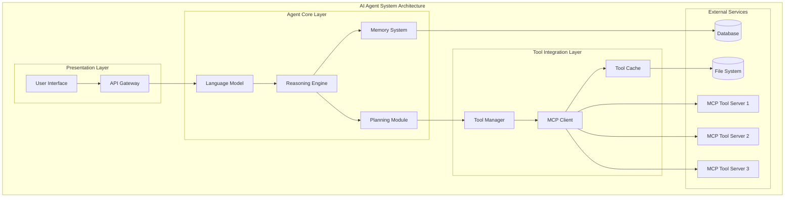
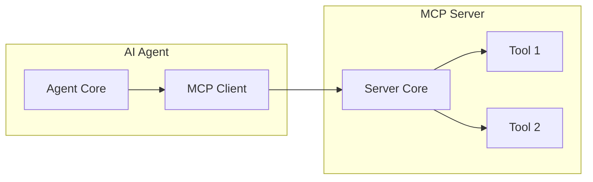
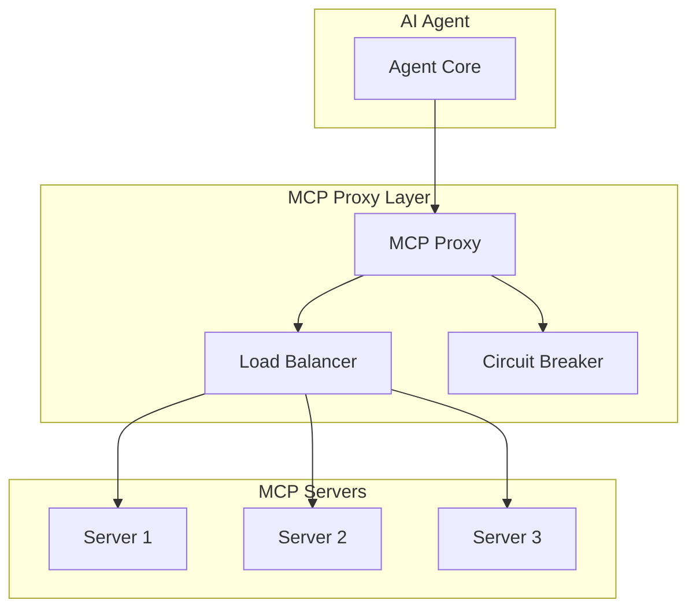

# AI代理集成架构说明

本文档详细说明了AI代理如何与MCP服务器集成，包括架构设计、集成模式、通信机制和最佳实践。

## 目录

- [AI代理架构概述](#ai代理架构概述)
- [MCP集成模式](#mcp集成模式)
- [通信机制详解](#通信机制详解)
- [状态管理](#状态管理)
- [错误处理和恢复](#错误处理和恢复)
- [性能优化策略](#性能优化策略)
- [安全考虑](#安全考虑)
- [实际应用案例](#实际应用案例)

## AI代理架构概述

### 现代AI代理系统架构

现代AI代理系统通常采用分层架构，将不同的关注点分离到不同的层次中：



### 各层职责详解

#### 1. 表示层 (Presentation Layer)

**职责**: 处理用户交互和外部API请求

```python
class AgentAPI:
    def __init__(self, agent_core: AgentCore):
        self.agent_core = agent_core
        self.session_manager = SessionManager()
    
    async def handle_user_request(self, user_id: str, message: str) -> str:
        """处理用户请求"""
        # 获取或创建会话
        session = await self.session_manager.get_session(user_id)
        
        # 处理请求
        response = await self.agent_core.process_message(session, message)
        
        # 更新会话状态
        await self.session_manager.update_session(session)
        
        return response
```

#### 2. 代理核心层 (Agent Core Layer)

**职责**: 实现AI代理的核心逻辑和决策能力

```python
class AgentCore:
    def __init__(self):
        self.llm = LanguageModel()
        self.reasoning_engine = ReasoningEngine()
        self.memory_system = MemorySystem()
        self.planning_module = PlanningModule()
        self.tool_manager = ToolManager()
    
    async def process_message(self, session: Session, message: str) -> str:
        """处理用户消息"""
        # 更新上下文
        context = await self.memory_system.get_context(session.id)
        context.add_user_message(message)
        
        # 推理和规划
        plan = await self.reasoning_engine.analyze_and_plan(context, message)
        
        # 执行计划
        result = await self.execute_plan(plan, context)
        
        # 更新记忆
        await self.memory_system.store_interaction(session.id, message, result)
        
        return result
```

## MCP集成模式

### 1. 直接集成模式

最简单的集成方式，AI代理直接与MCP服务器通信：



**优点**:
- 简单直接
- 延迟最低
- 易于调试

**缺点**:
- 缺乏容错能力
- 难以扩展
- 单点故障

**实现示例**:

```python
class DirectIntegrationAgent:
    def __init__(self, server_config: ServerConfig):
        self.mcp_client = MCPClient(server_config)
        self.tools = {}
    
    async def initialize(self):
        """初始化代理"""
        await self.mcp_client.connect()
        
        # 发现工具
        tools = await self.mcp_client.list_tools()
        for tool in tools:
            self.tools[tool.name] = tool
    
    async def use_tool(self, tool_name: str, **kwargs) -> str:
        """使用工具"""
        if tool_name not in self.tools:
            return f"Tool '{tool_name}' not available"
        
        try:
            result = await self.mcp_client.call_tool(tool_name, kwargs)
            return result.content[0].text
        except Exception as e:
            return f"Tool call failed: {e}"
```

### 2. 代理模式

通过代理层来管理多个MCP服务器：



**实现示例**:

```python
class MCPProxy:
    def __init__(self):
        self.servers = {}
        self.load_balancer = LoadBalancer()
        self.circuit_breaker = CircuitBreaker()
        self.health_checker = HealthChecker()
    
    async def register_server(self, name: str, config: ServerConfig):
        """注册MCP服务器"""
        client = MCPClient(config)
        await client.connect()
        
        self.servers[name] = {
            'client': client,
            'config': config,
            'health': 'healthy',
            'tools': await client.list_tools()
        }
        
        # 启动健康检查
        asyncio.create_task(self._monitor_server_health(name))
    
    async def call_tool(self, tool_name: str, arguments: dict) -> ToolResult:
        """调用工具"""
        # 查找提供该工具的服务器
        available_servers = [
            name for name, info in self.servers.items()
            if any(tool.name == tool_name for tool in info['tools'])
            and info['health'] == 'healthy'
        ]
        
        if not available_servers:
            raise ToolNotFoundError(f"No healthy server provides tool '{tool_name}'")
        
        # 负载均衡选择服务器
        selected_server = self.load_balancer.select(available_servers)
        
        # 断路器检查
        if not self.circuit_breaker.can_execute(selected_server):
            raise CircuitBreakerOpenError(f"Circuit breaker open for {selected_server}")
        
        try:
            # 调用工具
            client = self.servers[selected_server]['client']
            result = await client.call_tool(tool_name, arguments)
            
            # 记录成功
            self.circuit_breaker.record_success(selected_server)
            
            return result
            
        except Exception as e:
            # 记录失败
            self.circuit_breaker.record_failure(selected_server)
            raise
```

## 通信机制详解

### 异步通信模式

AI代理与MCP服务器之间的通信通常是异步的，以提高性能和响应能力：

```python
class AsyncCommunicationManager:
    def __init__(self):
        self.pending_requests = {}
        self.request_timeout = 30
        self.max_concurrent_requests = 100
        self.semaphore = asyncio.Semaphore(self.max_concurrent_requests)
    
    async def send_request(self, client: MCPClient, request: MCPRequest) -> MCPResponse:
        """发送异步请求"""
        async with self.semaphore:
            # 创建Future对象
            future = asyncio.Future()
            request_id = request.id
            
            # 记录待处理请求
            self.pending_requests[request_id] = future
            
            try:
                # 发送请求
                await client.send_message(request)
                
                # 等待响应（带超时）
                response = await asyncio.wait_for(future, timeout=self.request_timeout)
                
                return response
                
            except asyncio.TimeoutError:
                raise RequestTimeoutError(f"Request {request_id} timed out")
            
            finally:
                # 清理
                self.pending_requests.pop(request_id, None)
```

### 批量请求优化

对于需要调用多个工具的场景，可以使用批量请求来优化性能：

```python
class BatchRequestManager:
    def __init__(self, batch_size: int = 10, batch_timeout: float = 0.1):
        self.batch_size = batch_size
        self.batch_timeout = batch_timeout
        self.pending_requests = []
        self.batch_timer = None
    
    async def add_request(self, client: MCPClient, tool_name: str, arguments: dict) -> ToolResult:
        """添加请求到批次"""
        future = asyncio.Future()
        
        request = {
            'client': client,
            'tool_name': tool_name,
            'arguments': arguments,
            'future': future
        }
        
        self.pending_requests.append(request)
        
        # 检查是否需要立即执行批次
        if len(self.pending_requests) >= self.batch_size:
            await self._execute_batch()
        else:
            # 设置定时器
            if self.batch_timer is None:
                self.batch_timer = asyncio.create_task(self._batch_timeout_handler())
        
        return await future
```

## 状态管理

### 会话状态管理

AI代理需要维护与用户的会话状态：

```python
class SessionManager:
    def __init__(self):
        self.sessions = {}
        self.session_timeout = 3600  # 1小时
        self.cleanup_interval = 300  # 5分钟清理一次
        
        # 启动清理任务
        asyncio.create_task(self._cleanup_expired_sessions())
    
    async def get_session(self, user_id: str) -> Session:
        """获取或创建会话"""
        if user_id in self.sessions:
            session = self.sessions[user_id]
            session.last_activity = time.time()
            return session
        
        # 创建新会话
        session = Session(
            id=user_id,
            created_at=time.time(),
            last_activity=time.time(),
            context=ConversationContext(),
            tool_state=ToolState()
        )
        
        self.sessions[user_id] = session
        return session
```

## 错误处理和恢复

### 分层错误处理

实现分层的错误处理机制：

```python
class LayeredErrorHandler:
    def __init__(self):
        self.error_handlers = {
            'transport': TransportErrorHandler(),
            'protocol': ProtocolErrorHandler(),
            'tool': ToolErrorHandler(),
            'application': ApplicationErrorHandler()
        }
        self.recovery_strategies = RecoveryStrategies()
    
    async def handle_error(self, error: Exception, context: dict) -> ErrorHandlingResult:
        """处理错误"""
        error_type = self._classify_error(error)
        handler = self.error_handlers.get(error_type)
        
        if handler:
            # 尝试处理错误
            result = await handler.handle(error, context)
            
            if result.recoverable:
                # 尝试恢复
                recovery_result = await self.recovery_strategies.recover(
                    error_type, error, context
                )
                return recovery_result
            else:
                return result
        
        # 未知错误类型，使用默认处理
        return ErrorHandlingResult(
            success=False,
            recoverable=False,
            message=f"Unhandled error: {str(error)}"
        )
```

## 性能优化策略

### 智能缓存策略

实现多级缓存来提高性能：

```python
class IntelligentCache:
    def __init__(self):
        self.l1_cache = {}  # 内存缓存
        self.l2_cache = None  # Redis缓存
        self.cache_stats = CacheStats()
        self.cache_policies = CachePolicies()
    
    async def get(self, key: str, context: dict = None) -> Optional[Any]:
        """智能获取缓存"""
        # L1缓存查找
        if key in self.l1_cache:
            item = self.l1_cache[key]
            if self._is_valid(item, context):
                self.cache_stats.record_hit('l1')
                return item['value']
            else:
                del self.l1_cache[key]
        
        # L2缓存查找
        if self.l2_cache:
            value = await self.l2_cache.get(key)
            if value and self._is_valid({'value': value, 'timestamp': time.time()}, context):
                self.cache_stats.record_hit('l2')
                # 回填L1缓存
                self._set_l1_cache(key, value, context)
                return value
        
        self.cache_stats.record_miss()
        return None
```

## 安全考虑

### 权限管理

实现细粒度的权限管理：

```python
class PermissionManager:
    def __init__(self):
        self.user_permissions = {}
        self.role_permissions = {}
        self.tool_requirements = {}
    
    def define_tool_requirements(self, tool_name: str, required_permissions: List[str]):
        """定义工具所需权限"""
        self.tool_requirements[tool_name] = required_permissions
    
    def assign_role_permissions(self, role: str, permissions: List[str]):
        """分配角色权限"""
        self.role_permissions[role] = permissions
    
    def check_tool_permission(self, user_id: str, tool_name: str) -> bool:
        """检查工具使用权限"""
        required_permissions = self.tool_requirements.get(tool_name, [])
        if not required_permissions:
            return True  # 无特殊要求的工具允许使用
        
        user_permissions = self._get_user_permissions(user_id)
        
        return all(perm in user_permissions for perm in required_permissions)
```

## 实际应用案例

### 案例1: 智能文档处理助手

```python
class DocumentProcessingAgent:
    def __init__(self):
        self.tool_manager = ToolManager()
        self.document_analyzer = DocumentAnalyzer()
        self.workflow_engine = WorkflowEngine()
    
    async def initialize(self):
        """初始化助手"""
        # 注册文档处理相关工具
        await self.tool_manager.register_tools([
            {'name': 'base64_encode', 'server': 'base64-server'},
            {'name': 'base64_decode', 'server': 'base64-server'},
            {'name': 'pdf_extract', 'server': 'pdf-server'},
            {'name': 'ocr_process', 'server': 'ocr-server'},
            {'name': 'translate_text', 'server': 'translation-server'}
        ])
    
    async def process_document(self, document_data: str, processing_type: str) -> str:
        """处理文档"""
        # 分析文档类型和内容
        analysis = await self.document_analyzer.analyze(document_data)
        
        # 创建处理工作流
        workflow = await self.workflow_engine.create_workflow(
            analysis, processing_type
        )
        
        # 执行工作流
        result = await self._execute_workflow(workflow)
        
        return result
```

### 案例2: 多模态AI助手

```python
class MultimodalAIAssistant:
    def __init__(self):
        self.llm = LanguageModel()
        self.tool_manager = ToolManager()
        self.modality_router = ModalityRouter()
        self.context_manager = ContextManager()
    
    async def initialize(self):
        """初始化助手"""
        # 注册多模态工具
        await self.tool_manager.register_tools([
            {'name': 'base64_encode', 'server': 'base64-server'},
            {'name': 'base64_decode', 'server': 'base64-server'},
            {'name': 'image_analyze', 'server': 'vision-server'},
            {'name': 'speech_to_text', 'server': 'speech-server'},
            {'name': 'text_to_speech', 'server': 'tts-server'},
            {'name': 'web_search', 'server': 'search-server'}
        ])
    
    async def process_multimodal_input(self, inputs: List[dict]) -> str:
        """处理多模态输入"""
        processed_inputs = []
        
        for input_item in inputs:
            modality = input_item['type']
            data = input_item['data']
            
            # 路由到相应的处理器
            processor = self.modality_router.get_processor(modality)
            processed_data = await processor.process(data, self.tool_manager)
            
            processed_inputs.append({
                'modality': modality,
                'processed_data': processed_data
            })
        
        # 融合多模态信息
        fused_context = await self._fuse_multimodal_context(processed_inputs)
        
        # 生成响应
        response = await self.llm.generate_response(fused_context)
        
        return response
```

---

通过这些架构设计和实现示例，开发者可以构建强大、可扩展的AI代理系统，充分利用MCP协议的优势来集成各种外部工具和服务。关键是要根据具体的应用场景选择合适的集成模式，并实现完善的错误处理、性能优化和安全机制。