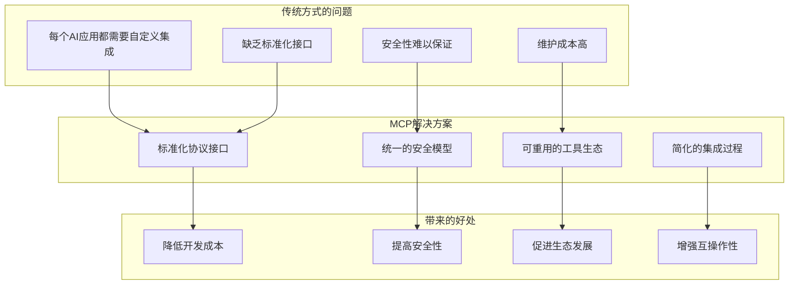
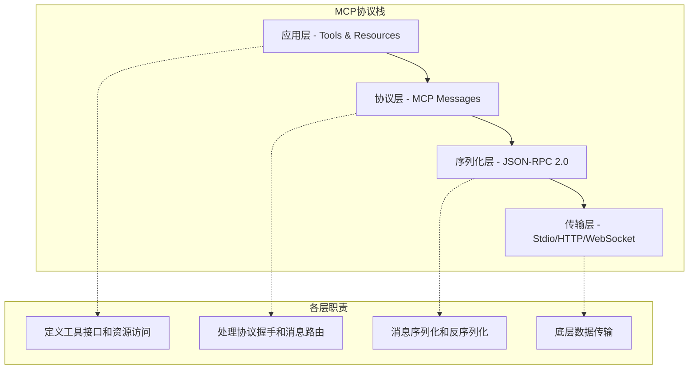
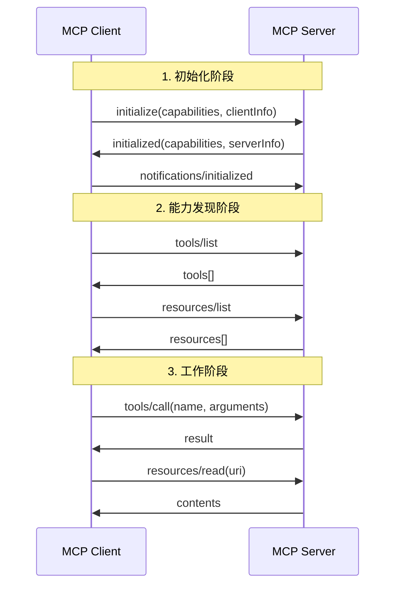
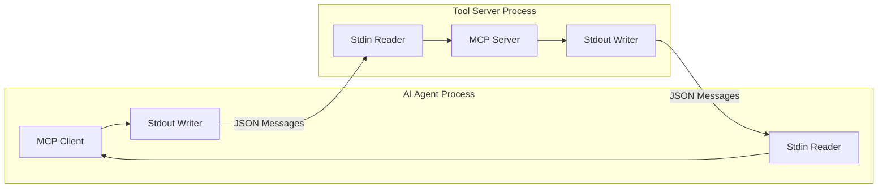
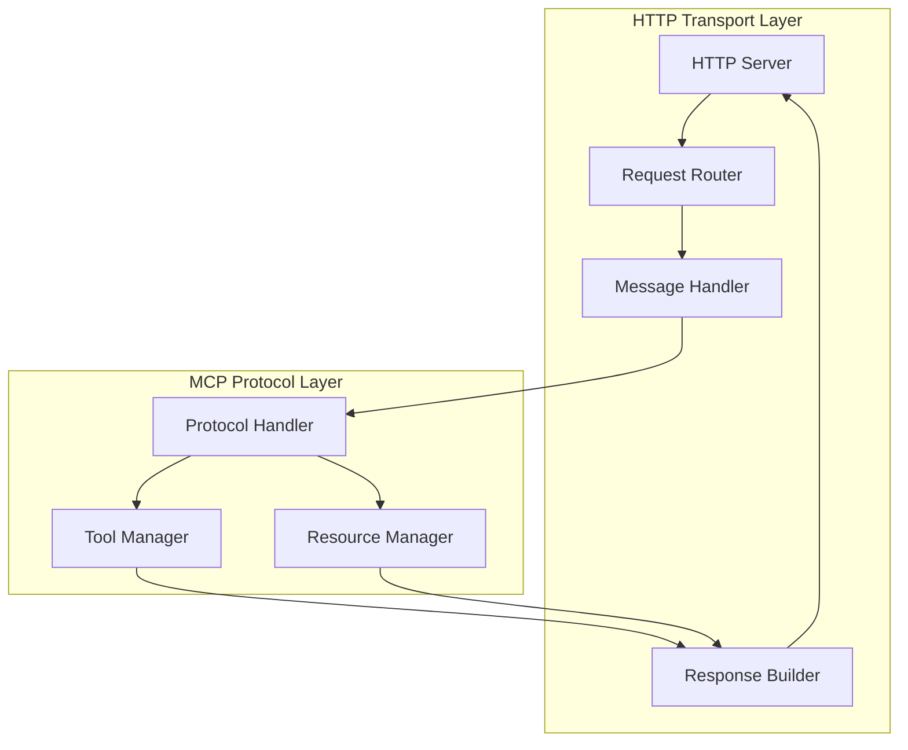
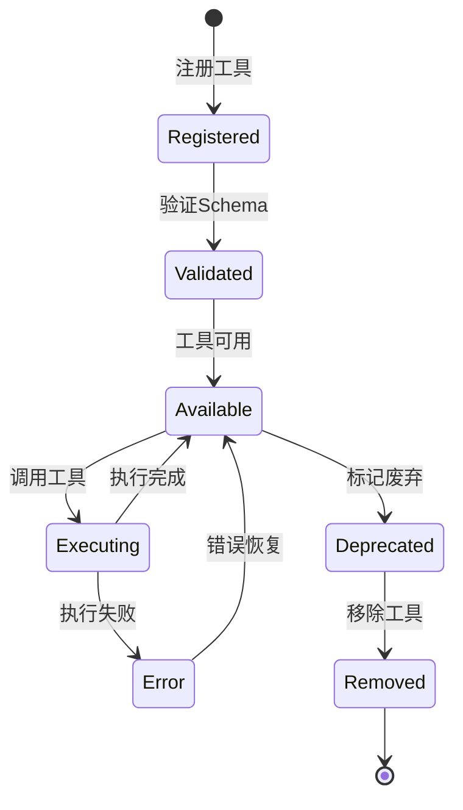

# MCP协议原理解释文档

本文档深入解释Model Context Protocol (MCP)的核心原理、设计思想和实现细节，帮助开发者理解MCP协议的工作机制以及如何构建高质量的MCP服务器。

## 目录

- [MCP协议概述](#mcp协议概述)
- [协议设计原理](#协议设计原理)
- [消息传输机制](#消息传输机制)
- [工具系统架构](#工具系统架构)
- [安全模型](#安全模型)
- [性能优化原理](#性能优化原理)
- [扩展性设计](#扩展性设计)
- [最佳实践指南](#最佳实践指南)

## MCP协议概述

### 什么是MCP？

Model Context Protocol (MCP) 是一个开放标准协议，专门设计用于AI模型与外部工具和数据源之间的安全、标准化通信。它解决了AI代理需要访问实时数据、执行操作和与各种系统集成的核心需求。

### 协议的核心价值



### 协议的关键特性

1. **基于JSON-RPC 2.0**: 使用成熟的RPC协议作为基础
2. **双向通信**: 支持客户端和服务器之间的双向消息传递
3. **类型安全**: 使用JSON Schema定义严格的数据类型
4. **传输无关**: 支持多种传输方式（stdio、HTTP、WebSocket等）
5. **可扩展性**: 支持自定义扩展和插件机制

## 协议设计原理

### 分层架构设计

MCP协议采用分层架构，每层都有明确的职责：



#### 应用层 (Application Layer)

**职责**: 定义具体的工具和资源接口

```python
# 工具定义示例
class ToolDefinition:
    name: str              # 工具名称
    description: str       # 工具描述
    inputSchema: dict      # 输入参数schema
    
# 资源定义示例
class ResourceDefinition:
    uri: str              # 资源URI
    name: str             # 资源名称
    description: str      # 资源描述
    mimeType: str         # MIME类型
```

**设计原则**:
- 工具应该是原子性的，执行单一明确的功能
- 参数schema应该严格定义，避免歧义
- 错误处理应该提供清晰的错误信息

#### 协议层 (Protocol Layer)

**职责**: 处理MCP特定的消息类型和协议逻辑

```python
# MCP消息类型
class MCPMessageType:
    # 初始化相关
    INITIALIZE = "initialize"
    INITIALIZED = "notifications/initialized"
    
    # 工具相关
    TOOLS_LIST = "tools/list"
    TOOLS_CALL = "tools/call"
    
    # 资源相关
    RESOURCES_LIST = "resources/list"
    RESOURCES_READ = "resources/read"
    
    # 提示相关
    PROMPTS_LIST = "prompts/list"
    PROMPTS_GET = "prompts/get"
```

**协议握手流程**:



#### 序列化层 (Serialization Layer)

**职责**: 基于JSON-RPC 2.0的消息序列化

```json
// 请求消息格式
{
  "jsonrpc": "2.0",
  "id": 1,
  "method": "tools/call",
  "params": {
    "name": "base64_encode",
    "arguments": {
      "text": "Hello, World!"
    }
  }
}

// 响应消息格式
{
  "jsonrpc": "2.0",
  "id": 1,
  "result": {
    "content": [
      {
        "type": "text",
        "text": "SGVsbG8sIFdvcmxkIQ=="
      }
    ]
  }
}

// 错误消息格式
{
  "jsonrpc": "2.0",
  "id": 1,
  "error": {
    "code": -1001,
    "message": "Invalid base64 string",
    "data": {
      "input": "invalid-base64!",
      "details": "Contains invalid characters"
    }
  }
}
```

#### 传输层 (Transport Layer)

**职责**: 提供可靠的消息传输机制

支持的传输方式：

1. **Stdio传输**: 适用于进程间通信
2. **HTTP传输**: 适用于网络服务
3. **WebSocket传输**: 适用于实时通信
4. **自定义传输**: 支持扩展其他传输方式

### 消息流控制

MCP协议实现了完善的消息流控制机制：

```python
class MessageFlowControl:
    def __init__(self):
        self.pending_requests = {}  # 待处理请求
        self.request_timeout = 30   # 请求超时时间
        self.max_concurrent = 100   # 最大并发请求数
    
    def send_request(self, request: MCPRequest) -> Future:
        """发送请求并返回Future对象"""
        if len(self.pending_requests) >= self.max_concurrent:
            raise TooManyRequestsError()
        
        future = Future()
        self.pending_requests[request.id] = {
            'future': future,
            'timestamp': time.time()
        }
        
        # 设置超时处理
        self.schedule_timeout(request.id)
        
        return future
    
    def handle_response(self, response: MCPResponse):
        """处理响应消息"""
        if response.id in self.pending_requests:
            future = self.pending_requests[response.id]['future']
            if response.error:
                future.set_exception(MCPError(response.error))
            else:
                future.set_result(response.result)
            del self.pending_requests[response.id]
```

## 消息传输机制

### Stdio传输详解

Stdio传输是MCP协议最常用的传输方式，特别适合AI代理与工具服务器之间的通信。

#### 工作原理



#### 实现细节

```python
class StdioTransport:
    def __init__(self):
        self.stdin = sys.stdin
        self.stdout = sys.stdout
        self.running = False
        self.message_queue = asyncio.Queue()
    
    async def start(self):
        """启动stdio传输"""
        self.running = True
        
        # 启动读取任务
        asyncio.create_task(self._read_messages())
        
        # 启动处理任务
        asyncio.create_task(self._process_messages())
    
    async def _read_messages(self):
        """从stdin读取消息"""
        while self.running:
            try:
                line = await self._read_line()
                if line:
                    message = json.loads(line)
                    await self.message_queue.put(message)
            except json.JSONDecodeError as e:
                self._handle_parse_error(e)
            except Exception as e:
                self._handle_transport_error(e)
    
    async def _read_line(self) -> str:
        """异步读取一行数据"""
        loop = asyncio.get_event_loop()
        return await loop.run_in_executor(None, self.stdin.readline)
    
    def send_message(self, message: dict):
        """发送消息到stdout"""
        json_str = json.dumps(message, ensure_ascii=False)
        self.stdout.write(json_str + '\n')
        self.stdout.flush()
```

#### 错误处理机制

```python
class StdioErrorHandler:
    def handle_parse_error(self, error: json.JSONDecodeError):
        """处理JSON解析错误"""
        error_response = {
            "jsonrpc": "2.0",
            "id": None,
            "error": {
                "code": -32700,
                "message": "Parse error",
                "data": {
                    "position": error.pos,
                    "line": error.lineno,
                    "column": error.colno
                }
            }
        }
        self.send_message(error_response)
    
    def handle_transport_error(self, error: Exception):
        """处理传输层错误"""
        if isinstance(error, BrokenPipeError):
            # 客户端断开连接
            self.shutdown()
        elif isinstance(error, TimeoutError):
            # 读取超时
            self.reset_connection()
        else:
            # 其他未知错误
            self.log_error(error)
```

### HTTP传输详解

HTTP传输提供了更灵活的网络通信方式，支持RESTful API和长连接。

#### 架构设计



#### 实现示例

```python
class HTTPTransport:
    def __init__(self, host: str = "localhost", port: int = 3000):
        self.host = host
        self.port = port
        self.app = self._create_app()
        self.protocol_handler = None
    
    def _create_app(self):
        """创建HTTP应用"""
        app = web.Application()
        
        # 添加路由
        app.router.add_post('/mcp', self.handle_mcp_request)
        app.router.add_options('/mcp', self.handle_cors_preflight)
        
        # 添加中间件
        app.middlewares.append(self.cors_middleware)
        app.middlewares.append(self.error_middleware)
        app.middlewares.append(self.logging_middleware)
        
        return app
    
    async def handle_mcp_request(self, request):
        """处理MCP请求"""
        try:
            # 解析请求体
            body = await request.json()
            
            # 验证JSON-RPC格式
            self._validate_jsonrpc(body)
            
            # 创建MCP请求对象
            mcp_request = MCPRequest.from_dict(body)
            
            # 处理请求
            response = await self.protocol_handler.handle_request(mcp_request)
            
            # 返回响应
            return web.json_response(response.to_dict())
            
        except json.JSONDecodeError:
            return self._create_parse_error_response()
        except ValidationError as e:
            return self._create_validation_error_response(e)
        except Exception as e:
            return self._create_internal_error_response(e)
    
    @web.middleware
    async def cors_middleware(self, request, handler):
        """CORS中间件"""
        response = await handler(request)
        response.headers['Access-Control-Allow-Origin'] = '*'
        response.headers['Access-Control-Allow-Methods'] = 'GET, POST, OPTIONS'
        response.headers['Access-Control-Allow-Headers'] = 'Content-Type'
        return response
    
    @web.middleware
    async def error_middleware(self, request, handler):
        """错误处理中间件"""
        try:
            return await handler(request)
        except web.HTTPException:
            raise
        except Exception as e:
            logger.error(f"Unhandled error: {e}", exc_info=True)
            return web.json_response(
                self._create_internal_error_response(e),
                status=500
            )
```

## 工具系统架构

### 工具生命周期管理

MCP工具系统实现了完整的工具生命周期管理：



#### 工具注册机制

```python
class ToolRegistry:
    def __init__(self):
        self.tools = {}
        self.validators = {}
        self.middleware = []
    
    def register_tool(self, tool_def: ToolDefinition, handler: Callable):
        """注册工具"""
        # 验证工具定义
        self._validate_tool_definition(tool_def)
        
        # 编译JSON Schema验证器
        validator = jsonschema.Draft7Validator(tool_def.inputSchema)
        self.validators[tool_def.name] = validator
        
        # 注册工具处理器
        self.tools[tool_def.name] = {
            'definition': tool_def,
            'handler': handler,
            'metadata': {
                'registered_at': datetime.utcnow(),
                'call_count': 0,
                'error_count': 0,
                'avg_execution_time': 0.0
            }
        }
        
        logger.info(f"Tool '{tool_def.name}' registered successfully")
    
    async def call_tool(self, name: str, arguments: dict) -> ToolResult:
        """调用工具"""
        if name not in self.tools:
            raise ToolNotFoundError(f"Tool '{name}' not found")
        
        tool_info = self.tools[name]
        
        # 验证参数
        try:
            self.validators[name].validate(arguments)
        except jsonschema.ValidationError as e:
            raise InvalidArgumentsError(f"Invalid arguments: {e.message}")
        
        # 执行中间件（前置）
        for middleware in self.middleware:
            arguments = await middleware.before_call(name, arguments)
        
        # 记录开始时间
        start_time = time.time()
        
        try:
            # 调用工具处理器
            result = await tool_info['handler'](arguments)
            
            # 更新统计信息
            execution_time = time.time() - start_time
            self._update_tool_stats(name, execution_time, success=True)
            
            # 执行中间件（后置）
            for middleware in reversed(self.middleware):
                result = await middleware.after_call(name, arguments, result)
            
            return result
            
        except Exception as e:
            # 更新错误统计
            execution_time = time.time() - start_time
            self._update_tool_stats(name, execution_time, success=False)
            
            # 执行错误中间件
            for middleware in reversed(self.middleware):
                await middleware.on_error(name, arguments, e)
            
            raise ToolExecutionError(f"Tool execution failed: {str(e)}")
```

### 参数验证系统

MCP使用JSON Schema进行严格的参数验证：

```python
class ParameterValidator:
    def __init__(self):
        self.schema_cache = {}
        self.custom_validators = {}
    
    def add_custom_validator(self, name: str, validator: Callable):
        """添加自定义验证器"""
        self.custom_validators[name] = validator
    
    def validate_parameters(self, schema: dict, parameters: dict):
        """验证参数"""
        # 获取或创建验证器
        validator = self._get_validator(schema)
        
        # 执行基础验证
        try:
            validator.validate(parameters)
        except jsonschema.ValidationError as e:
            raise ParameterValidationError(
                message=e.message,
                path=list(e.absolute_path),
                schema_path=list(e.schema_path)
            )
        
        # 执行自定义验证
        self._run_custom_validations(schema, parameters)
    
    def _get_validator(self, schema: dict):
        """获取或创建JSON Schema验证器"""
        schema_hash = hash(json.dumps(schema, sort_keys=True))
        
        if schema_hash not in self.schema_cache:
            # 扩展schema以支持自定义验证器
            extended_schema = self._extend_schema(schema)
            validator = jsonschema.Draft7Validator(extended_schema)
            self.schema_cache[schema_hash] = validator
        
        return self.schema_cache[schema_hash]
    
    def _extend_schema(self, schema: dict) -> dict:
        """扩展schema以支持自定义验证"""
        extended = schema.copy()
        
        # 添加自定义格式验证
        if 'properties' in extended:
            for prop_name, prop_schema in extended['properties'].items():
                if 'format' in prop_schema:
                    format_name = prop_schema['format']
                    if format_name in self.custom_validators:
                        # 标记需要自定义验证
                        prop_schema['x-custom-validator'] = format_name
        
        return extended
```

### 工具中间件系统

中间件系统提供了横切关注点的处理能力：

```python
class ToolMiddleware:
    """工具中间件基类"""
    
    async def before_call(self, tool_name: str, arguments: dict) -> dict:
        """工具调用前的处理"""
        return arguments
    
    async def after_call(self, tool_name: str, arguments: dict, result: ToolResult) -> ToolResult:
        """工具调用后的处理"""
        return result
    
    async def on_error(self, tool_name: str, arguments: dict, error: Exception):
        """错误处理"""
        pass

class LoggingMiddleware(ToolMiddleware):
    """日志中间件"""
    
    async def before_call(self, tool_name: str, arguments: dict) -> dict:
        logger.info(f"Calling tool '{tool_name}' with arguments: {arguments}")
        return arguments
    
    async def after_call(self, tool_name: str, arguments: dict, result: ToolResult) -> ToolResult:
        logger.info(f"Tool '{tool_name}' completed successfully")
        return result
    
    async def on_error(self, tool_name: str, arguments: dict, error: Exception):
        logger.error(f"Tool '{tool_name}' failed: {error}")

class RateLimitMiddleware(ToolMiddleware):
    """速率限制中间件"""
    
    def __init__(self, max_calls_per_minute: int = 60):
        self.max_calls = max_calls_per_minute
        self.call_history = defaultdict(list)
    
    async def before_call(self, tool_name: str, arguments: dict) -> dict:
        now = time.time()
        minute_ago = now - 60
        
        # 清理过期记录
        self.call_history[tool_name] = [
            timestamp for timestamp in self.call_history[tool_name]
            if timestamp > minute_ago
        ]
        
        # 检查速率限制
        if len(self.call_history[tool_name]) >= self.max_calls:
            raise RateLimitExceededError(
                f"Rate limit exceeded for tool '{tool_name}'"
            )
        
        # 记录调用时间
        self.call_history[tool_name].append(now)
        
        return arguments

class CachingMiddleware(ToolMiddleware):
    """缓存中间件"""
    
    def __init__(self, ttl: int = 300):  # 5分钟TTL
        self.cache = {}
        self.ttl = ttl
    
    async def before_call(self, tool_name: str, arguments: dict) -> dict:
        # 生成缓存键
        cache_key = self._generate_cache_key(tool_name, arguments)
        
        # 检查缓存
        if cache_key in self.cache:
            cached_item = self.cache[cache_key]
            if time.time() - cached_item['timestamp'] < self.ttl:
                # 缓存命中，直接返回结果
                raise CacheHitException(cached_item['result'])
        
        return arguments
    
    async def after_call(self, tool_name: str, arguments: dict, result: ToolResult) -> ToolResult:
        # 缓存结果
        cache_key = self._generate_cache_key(tool_name, arguments)
        self.cache[cache_key] = {
            'result': result,
            'timestamp': time.time()
        }
        
        return result
    
    def _generate_cache_key(self, tool_name: str, arguments: dict) -> str:
        """生成缓存键"""
        args_str = json.dumps(arguments, sort_keys=True)
        return f"{tool_name}:{hashlib.md5(args_str.encode()).hexdigest()}"
```

## 安全模型

### 权限控制系统

MCP实现了基于能力的权限控制模型：

```python
class CapabilityBasedSecurity:
    def __init__(self):
        self.capabilities = {}
        self.permissions = {}
        self.access_policies = {}
    
    def define_capability(self, name: str, description: str, required_permissions: List[str]):
        """定义能力"""
        self.capabilities[name] = {
            'description': description,
            'required_permissions': required_permissions,
            'created_at': datetime.utcnow()
        }
    
    def grant_permission(self, client_id: str, permission: str):
        """授予权限"""
        if client_id not in self.permissions:
            self.permissions[client_id] = set()
        self.permissions[client_id].add(permission)
    
    def check_capability(self, client_id: str, capability: str) -> bool:
        """检查能力"""
        if capability not in self.capabilities:
            return False
        
        required_permissions = self.capabilities[capability]['required_permissions']
        client_permissions = self.permissions.get(client_id, set())
        
        return all(perm in client_permissions for perm in required_permissions)
    
    def create_access_policy(self, policy_name: str, rules: List[dict]):
        """创建访问策略"""
        self.access_policies[policy_name] = {
            'rules': rules,
            'created_at': datetime.utcnow()
        }
    
    def evaluate_access(self, client_id: str, resource: str, action: str) -> bool:
        """评估访问权限"""
        for policy_name, policy in self.access_policies.items():
            for rule in policy['rules']:
                if self._match_rule(rule, client_id, resource, action):
                    return rule.get('allow', False)
        
        # 默认拒绝
        return False
```

### 输入验证和清理

```python
class InputSanitizer:
    def __init__(self):
        self.sanitizers = {
            'string': self._sanitize_string,
            'base64': self._sanitize_base64,
            'url': self._sanitize_url,
            'email': self._sanitize_email
        }
    
    def sanitize_input(self, value: Any, data_type: str) -> Any:
        """清理输入数据"""
        if data_type in self.sanitizers:
            return self.sanitizers[data_type](value)
        return value
    
    def _sanitize_string(self, value: str) -> str:
        """清理字符串输入"""
        if not isinstance(value, str):
            raise ValueError("Expected string input")
        
        # 长度限制
        if len(value) > 1048576:  # 1MB
            raise ValueError("Input too large")
        
        # 移除控制字符
        sanitized = ''.join(char for char in value if ord(char) >= 32 or char in '\t\n\r')
        
        # HTML转义（如果需要）
        sanitized = html.escape(sanitized)
        
        return sanitized
    
    def _sanitize_base64(self, value: str) -> str:
        """清理base64输入"""
        if not isinstance(value, str):
            raise ValueError("Expected string input")
        
        # 移除空白字符
        cleaned = re.sub(r'\s+', '', value)
        
        # 验证base64字符集
        if not re.match(r'^[A-Za-z0-9+/]*={0,2}$', cleaned):
            raise ValueError("Invalid base64 characters")
        
        # 验证长度
        if len(cleaned) % 4 != 0:
            raise ValueError("Invalid base64 padding")
        
        return cleaned
    
    def _sanitize_url(self, value: str) -> str:
        """清理URL输入"""
        parsed = urllib.parse.urlparse(value)
        
        # 检查协议
        if parsed.scheme not in ['http', 'https']:
            raise ValueError("Invalid URL scheme")
        
        # 检查主机名
        if not parsed.netloc:
            raise ValueError("Missing hostname")
        
        return value
```

### 加密和签名

```python
class CryptographicSecurity:
    def __init__(self, private_key_path: str, public_key_path: str):
        self.private_key = self._load_private_key(private_key_path)
        self.public_key = self._load_public_key(public_key_path)
    
    def sign_message(self, message: dict) -> str:
        """对消息进行数字签名"""
        message_bytes = json.dumps(message, sort_keys=True).encode()
        signature = self.private_key.sign(
            message_bytes,
            padding.PSS(
                mgf=padding.MGF1(hashes.SHA256()),
                salt_length=padding.PSS.MAX_LENGTH
            ),
            hashes.SHA256()
        )
        return base64.b64encode(signature).decode()
    
    def verify_signature(self, message: dict, signature: str) -> bool:
        """验证消息签名"""
        try:
            message_bytes = json.dumps(message, sort_keys=True).encode()
            signature_bytes = base64.b64decode(signature)
            
            self.public_key.verify(
                signature_bytes,
                message_bytes,
                padding.PSS(
                    mgf=padding.MGF1(hashes.SHA256()),
                    salt_length=padding.PSS.MAX_LENGTH
                ),
                hashes.SHA256()
            )
            return True
        except Exception:
            return False
    
    def encrypt_sensitive_data(self, data: str) -> str:
        """加密敏感数据"""
        data_bytes = data.encode()
        encrypted = self.public_key.encrypt(
            data_bytes,
            padding.OAEP(
                mgf=padding.MGF1(algorithm=hashes.SHA256()),
                algorithm=hashes.SHA256(),
                label=None
            )
        )
        return base64.b64encode(encrypted).decode()
    
    def decrypt_sensitive_data(self, encrypted_data: str) -> str:
        """解密敏感数据"""
        encrypted_bytes = base64.b64decode(encrypted_data)
        decrypted = self.private_key.decrypt(
            encrypted_bytes,
            padding.OAEP(
                mgf=padding.MGF1(algorithm=hashes.SHA256()),
                algorithm=hashes.SHA256(),
                label=None
            )
        )
        return decrypted.decode()
```

## 性能优化原理

### 异步处理架构

MCP服务器采用异步处理架构来提高性能：

```python
class AsyncMCPServer:
    def __init__(self):
        self.request_queue = asyncio.Queue(maxsize=1000)
        self.worker_pool = []
        self.worker_count = 4
        self.metrics = PerformanceMetrics()
    
    async def start(self):
        """启动异步服务器"""
        # 启动工作线程
        for i in range(self.worker_count):
            worker = asyncio.create_task(self._worker(f"worker-{i}"))
            self.worker_pool.append(worker)
        
        # 启动监控任务
        asyncio.create_task(self._monitor_performance())
    
    async def _worker(self, worker_id: str):
        """工作线程"""
        while True:
            try:
                # 从队列获取请求
                request_data = await self.request_queue.get()
                
                # 处理请求
                start_time = time.time()
                response = await self._process_request(request_data)
                processing_time = time.time() - start_time
                
                # 更新性能指标
                self.metrics.record_request(processing_time)
                
                # 发送响应
                await self._send_response(response)
                
                # 标记任务完成
                self.request_queue.task_done()
                
            except Exception as e:
                logger.error(f"Worker {worker_id} error: {e}")
                self.metrics.record_error()
    
    async def handle_request(self, request: MCPRequest):
        """处理传入请求"""
        try:
            # 将请求放入队列
            await self.request_queue.put(request)
        except asyncio.QueueFull:
            raise ServerOverloadedError("Request queue is full")
```

### 缓存策略

实现多层缓存来提高响应速度：

```python
class MultiLevelCache:
    def __init__(self):
        self.l1_cache = {}  # 内存缓存
        self.l2_cache = None  # Redis缓存
        self.l3_cache = None  # 数据库缓存
        
        self.l1_max_size = 1000
        self.l1_ttl = 300  # 5分钟
        
    async def get(self, key: str) -> Optional[Any]:
        """获取缓存值"""
        # L1缓存查找
        if key in self.l1_cache:
            item = self.l1_cache[key]
            if time.time() - item['timestamp'] < self.l1_ttl:
                return item['value']
            else:
                del self.l1_cache[key]
        
        # L2缓存查找
        if self.l2_cache:
            value = await self.l2_cache.get(key)
            if value:
                # 回填L1缓存
                self._set_l1_cache(key, value)
                return value
        
        # L3缓存查找
        if self.l3_cache:
            value = await self.l3_cache.get(key)
            if value:
                # 回填上层缓存
                if self.l2_cache:
                    await self.l2_cache.set(key, value, ttl=3600)
                self._set_l1_cache(key, value)
                return value
        
        return None
    
    async def set(self, key: str, value: Any, ttl: int = None):
        """设置缓存值"""
        # 设置L1缓存
        self._set_l1_cache(key, value)
        
        # 设置L2缓存
        if self.l2_cache:
            await self.l2_cache.set(key, value, ttl=ttl or 3600)
        
        # 设置L3缓存
        if self.l3_cache:
            await self.l3_cache.set(key, value, ttl=ttl or 86400)
    
    def _set_l1_cache(self, key: str, value: Any):
        """设置L1缓存"""
        # 检查缓存大小限制
        if len(self.l1_cache) >= self.l1_max_size:
            # 移除最旧的条目
            oldest_key = min(self.l1_cache.keys(), 
                           key=lambda k: self.l1_cache[k]['timestamp'])
            del self.l1_cache[oldest_key]
        
        self.l1_cache[key] = {
            'value': value,
            'timestamp': time.time()
        }
```

### 连接池管理

```python
class ConnectionPool:
    def __init__(self, max_connections: int = 100):
        self.max_connections = max_connections
        self.active_connections = {}
        self.idle_connections = asyncio.Queue(maxsize=max_connections)
        self.connection_count = 0
        self.lock = asyncio.Lock()
    
    async def acquire_connection(self) -> Connection:
        """获取连接"""
        # 尝试从空闲连接池获取
        try:
            connection = self.idle_connections.get_nowait()
            if connection.is_healthy():
                return connection
            else:
                await connection.close()
                self.connection_count -= 1
        except asyncio.QueueEmpty:
            pass
        
        # 创建新连接
        async with self.lock:
            if self.connection_count < self.max_connections:
                connection = await self._create_connection()
                self.connection_count += 1
                return connection
            else:
                # 等待连接可用
                return await self.idle_connections.get()
    
    async def release_connection(self, connection: Connection):
        """释放连接"""
        if connection.is_healthy():
            try:
                self.idle_connections.put_nowait(connection)
            except asyncio.QueueFull:
                await connection.close()
                self.connection_count -= 1
        else:
            await connection.close()
            self.connection_count -= 1
    
    async def _create_connection(self) -> Connection:
        """创建新连接"""
        connection = Connection()
        await connection.connect()
        return connection
```

## 扩展性设计

### 插件系统

MCP支持插件系统来扩展功能：

```python
class PluginManager:
    def __init__(self):
        self.plugins = {}
        self.hooks = defaultdict(list)
        self.plugin_configs = {}
    
    def register_plugin(self, plugin: Plugin):
        """注册插件"""
        plugin_name = plugin.get_name()
        
        # 验证插件
        self._validate_plugin(plugin)
        
        # 注册插件
        self.plugins[plugin_name] = plugin
        
        # 注册钩子
        for hook_name in plugin.get_hooks():
            self.hooks[hook_name].append(plugin)
        
        # 初始化插件
        plugin.initialize(self.plugin_configs.get(plugin_name, {}))
        
        logger.info(f"Plugin '{plugin_name}' registered successfully")
    
    async def execute_hook(self, hook_name: str, *args, **kwargs):
        """执行钩子"""
        results = []
        
        for plugin in self.hooks.get(hook_name, []):
            try:
                result = await plugin.execute_hook(hook_name, *args, **kwargs)
                results.append(result)
            except Exception as e:
                logger.error(f"Plugin {plugin.get_name()} hook {hook_name} failed: {e}")
        
        return results
    
    def _validate_plugin(self, plugin: Plugin):
        """验证插件"""
        required_methods = ['get_name', 'get_version', 'get_hooks', 'initialize', 'execute_hook']
        
        for method in required_methods:
            if not hasattr(plugin, method):
                raise PluginValidationError(f"Plugin missing required method: {method}")

class Plugin:
    """插件基类"""
    
    def get_name(self) -> str:
        """获取插件名称"""
        raise NotImplementedError
    
    def get_version(self) -> str:
        """获取插件版本"""
        raise NotImplementedError
    
    def get_hooks(self) -> List[str]:
        """获取插件支持的钩子"""
        raise NotImplementedError
    
    def initialize(self, config: dict):
        """初始化插件"""
        pass
    
    async def execute_hook(self, hook_name: str, *args, **kwargs):
        """执行钩子"""
        raise NotImplementedError

# 示例插件
class LoggingPlugin(Plugin):
    def get_name(self) -> str:
        return "logging_plugin"
    
    def get_version(self) -> str:
        return "1.0.0"
    
    def get_hooks(self) -> List[str]:
        return ["before_tool_call", "after_tool_call", "on_error"]
    
    async def execute_hook(self, hook_name: str, *args, **kwargs):
        if hook_name == "before_tool_call":
            tool_name = kwargs.get("tool_name")
            arguments = kwargs.get("arguments")
            logger.info(f"Calling tool {tool_name} with args: {arguments}")
        
        elif hook_name == "after_tool_call":
            tool_name = kwargs.get("tool_name")
            result = kwargs.get("result")
            logger.info(f"Tool {tool_name} completed with result: {result}")
        
        elif hook_name == "on_error":
            tool_name = kwargs.get("tool_name")
            error = kwargs.get("error")
            logger.error(f"Tool {tool_name} failed: {error}")
```

### 协议版本管理

```python
class ProtocolVersionManager:
    def __init__(self):
        self.supported_versions = ["2024-11-05", "2024-10-07"]
        self.default_version = "2024-11-05"
        self.version_handlers = {}
    
    def register_version_handler(self, version: str, handler: ProtocolHandler):
        """注册版本处理器"""
        self.version_handlers[version] = handler
    
    def negotiate_version(self, client_version: str) -> str:
        """协商协议版本"""
        if client_version in self.supported_versions:
            return client_version
        
        # 寻找兼容版本
        for version in self.supported_versions:
            if self._is_compatible(client_version, version):
                return version
        
        # 返回默认版本
        return self.default_version
    
    def get_handler(self, version: str) -> ProtocolHandler:
        """获取版本处理器"""
        return self.version_handlers.get(version, self.version_handlers[self.default_version])
    
    def _is_compatible(self, client_version: str, server_version: str) -> bool:
        """检查版本兼容性"""
        # 实现版本兼容性检查逻辑
        client_parts = client_version.split('-')
        server_parts = server_version.split('-')
        
        if len(client_parts) >= 3 and len(server_parts) >= 3:
            # 比较年份和月份
            return client_parts[0] == server_parts[0] and client_parts[1] == server_parts[1]
        
        return False
```

## 最佳实践指南

### 工具设计原则

1. **单一职责原则**: 每个工具应该只做一件事，并且做好
2. **幂等性**: 相同的输入应该产生相同的输出
3. **错误处理**: 提供清晰、有用的错误信息
4. **性能考虑**: 避免长时间运行的操作
5. **安全性**: 验证所有输入，避免安全漏洞

### 错误处理最佳实践

```python
class BestPracticeErrorHandler:
    def __init__(self):
        self.error_categories = {
            'validation': 'Input validation failed',
            'permission': 'Permission denied',
            'resource': 'Resource not available',
            'internal': 'Internal server error'
        }
    
    def create_error_response(self, category: str, message: str, details: dict = None) -> MCPError:
        """创建标准化错误响应"""
        error_code = self._get_error_code(category)
        
        return MCPError(
            code=error_code,
            message=f"{self.error_categories.get(category, 'Unknown error')}: {message}",
            data={
                'category': category,
                'details': details or {},
                'timestamp': datetime.utcnow().isoformat(),
                'request_id': self._generate_request_id()
            }
        )
    
    def _get_error_code(self, category: str) -> int:
        """获取错误代码"""
        codes = {
            'validation': -32602,
            'permission': -32001,
            'resource': -32002,
            'internal': -32603
        }
        return codes.get(category, -32603)
```

### 性能监控最佳实践

```python
class PerformanceMonitor:
    def __init__(self):
        self.metrics = {
            'request_count': 0,
            'error_count': 0,
            'total_response_time': 0.0,
            'max_response_time': 0.0,
            'min_response_time': float('inf')
        }
        self.histogram = {}
    
    def record_request(self, response_time: float, success: bool = True):
        """记录请求指标"""
        self.metrics['request_count'] += 1
        
        if not success:
            self.metrics['error_count'] += 1
        
        self.metrics['total_response_time'] += response_time
        self.metrics['max_response_time'] = max(self.metrics['max_response_time'], response_time)
        self.metrics['min_response_time'] = min(self.metrics['min_response_time'], response_time)
        
        # 更新直方图
        bucket = self._get_histogram_bucket(response_time)
        self.histogram[bucket] = self.histogram.get(bucket, 0) + 1
    
    def get_statistics(self) -> dict:
        """获取统计信息"""
        if self.metrics['request_count'] == 0:
            return {'message': 'No requests recorded'}
        
        avg_response_time = self.metrics['total_response_time'] / self.metrics['request_count']
        error_rate = self.metrics['error_count'] / self.metrics['request_count']
        
        return {
            'total_requests': self.metrics['request_count'],
            'error_count': self.metrics['error_count'],
            'error_rate': error_rate,
            'avg_response_time': avg_response_time,
            'max_response_time': self.metrics['max_response_time'],
            'min_response_time': self.metrics['min_response_time'],
            'response_time_histogram': self.histogram
        }
    
    def _get_histogram_bucket(self, response_time: float) -> str:
        """获取直方图桶"""
        if response_time < 0.1:
            return '<100ms'
        elif response_time < 0.5:
            return '100ms-500ms'
        elif response_time < 1.0:
            return '500ms-1s'
        elif response_time < 5.0:
            return '1s-5s'
        else:
            return '>5s'
```

### 测试策略

```python
class MCPTestFramework:
    def __init__(self, server: MCPServer):
        self.server = server
        self.test_results = []
    
    async def run_tool_test(self, tool_name: str, test_cases: List[dict]):
        """运行工具测试"""
        for i, test_case in enumerate(test_cases):
            test_name = f"{tool_name}_test_{i+1}"
            
            try:
                # 执行测试
                result = await self.server.call_tool(tool_name, test_case['input'])
                
                # 验证结果
                if 'expected_output' in test_case:
                    assert result == test_case['expected_output'], f"Output mismatch in {test_name}"
                
                if 'expected_error' in test_case:
                    assert False, f"Expected error in {test_name} but got success"
                
                self.test_results.append({
                    'test_name': test_name,
                    'status': 'PASS',
                    'message': 'Test passed successfully'
                })
                
            except Exception as e:
                if 'expected_error' in test_case:
                    expected_error = test_case['expected_error']
                    if expected_error in str(e):
                        self.test_results.append({
                            'test_name': test_name,
                            'status': 'PASS',
                            'message': f'Expected error caught: {e}'
                        })
                    else:
                        self.test_results.append({
                            'test_name': test_name,
                            'status': 'FAIL',
                            'message': f'Wrong error type: expected {expected_error}, got {e}'
                        })
                else:
                    self.test_results.append({
                        'test_name': test_name,
                        'status': 'FAIL',
                        'message': f'Unexpected error: {e}'
                    })
    
    def generate_test_report(self) -> dict:
        """生成测试报告"""
        total_tests = len(self.test_results)
        passed_tests = sum(1 for result in self.test_results if result['status'] == 'PASS')
        failed_tests = total_tests - passed_tests
        
        return {
            'summary': {
                'total_tests': total_tests,
                'passed_tests': passed_tests,
                'failed_tests': failed_tests,
                'success_rate': passed_tests / total_tests if total_tests > 0 else 0
            },
            'details': self.test_results
        }
```

---

通过理解这些核心原理和最佳实践，开发者可以构建高质量、安全、高性能的MCP服务器，为AI代理提供可靠的工具支持。MCP协议的设计充分考虑了现代分布式系统的需求，提供了完整的解决方案来连接AI模型与外部世界。